# course_web
## 前言
一个 Java Spring mvc写的选课系统。帮一个做助教的同学做的课程大作业，作业要求如下图示：

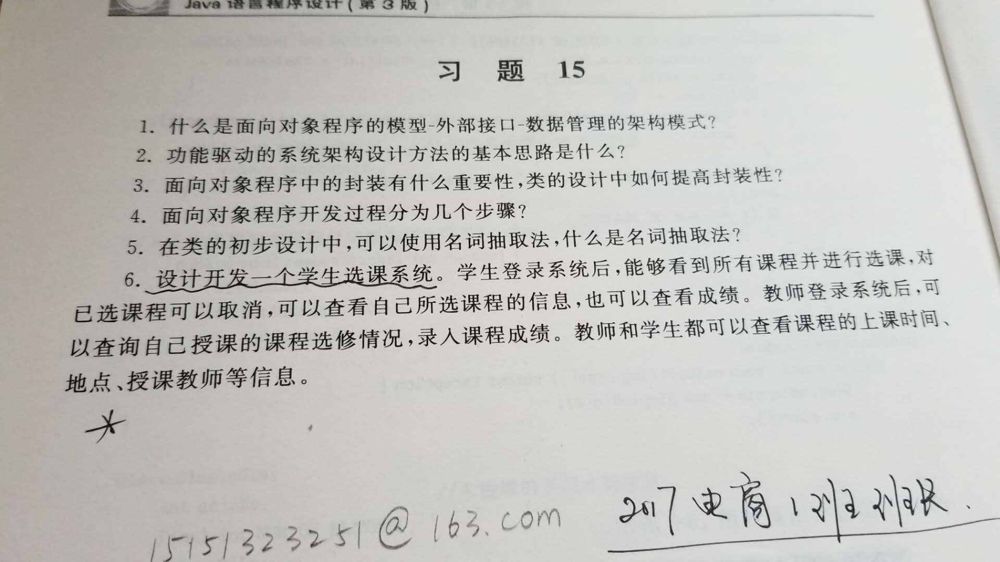
设计开发一个学生选课系统。学生登录后能够看到所有课程并进行选课，对于已选课程可以取消，可以查看自己所选课程的信息，也可以查看成绩。教师登录系统后，可以查询自己教授的课程选修情况，录入课程成绩。教师和学生都可以查看课程的上课时间，地点，授课教师等信息。

## 一、项目结构目录说明
### 1.course_web_mvc文件夹

此文件夹下存放的是Java的源码，src下存放的是项目的源码,test下存放的是测试代码，out下存放的是编译后的文件，web下存放的是网页的代码。
### 2.doc_file文件夹
此文件夹下存放的是文档的一些文件，比如图片等。
### 3.sql文件夹
此文件夹下存放的是MySQL的sql文件

## 二、数据库连接文件位置
修改数据库连接文件的方式如下图所示：

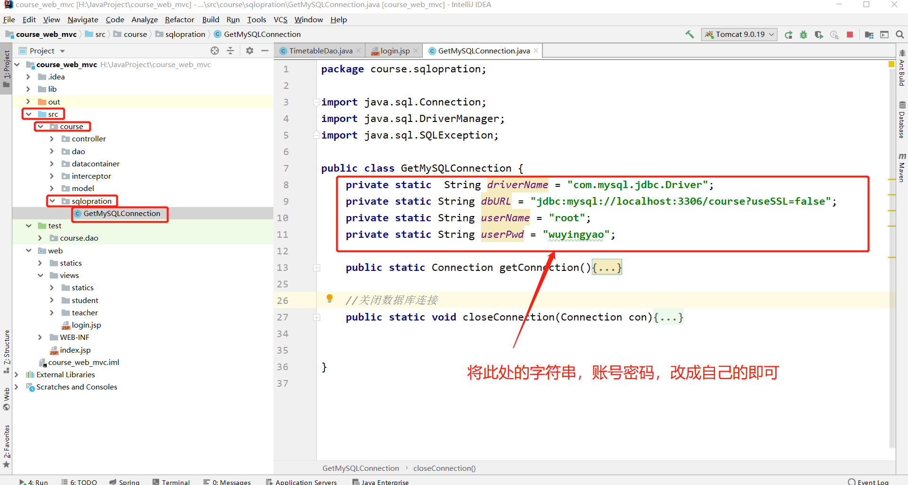

## 三、项目效果图显示
此项目使用了手绘风格的Bootstrap框架。网址：[Bootswatch](https://bootswatch.com/)

### 登录界面
登录界面如下图示：

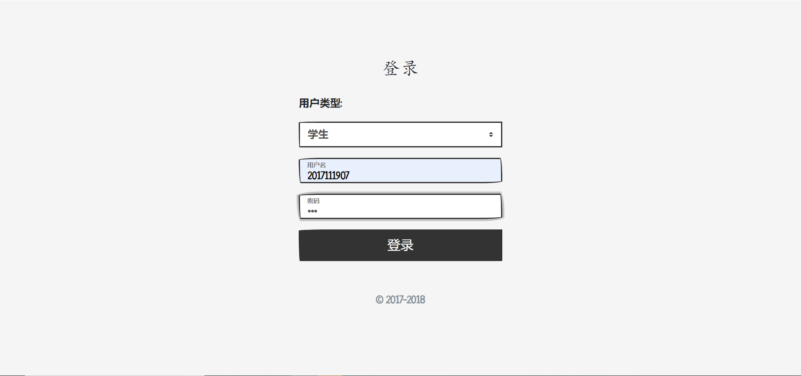

### 学生界面
- 学生主页

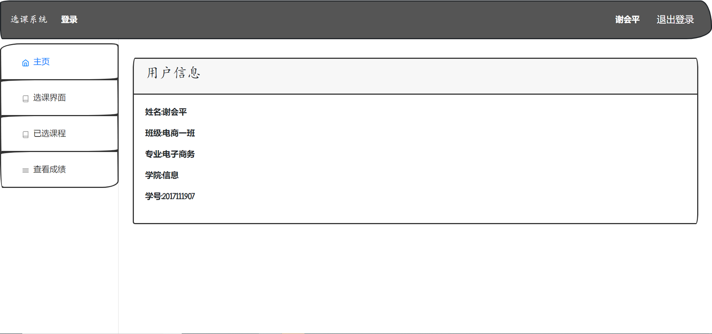

- 选课界面

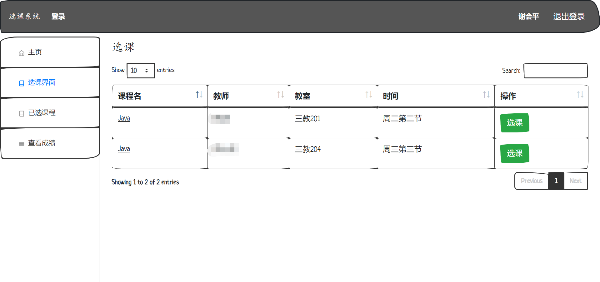

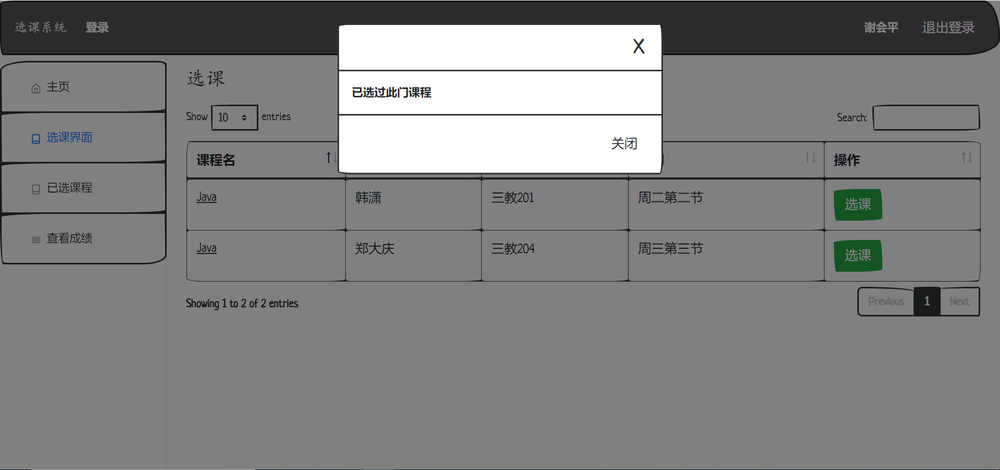

- 已选课程界面

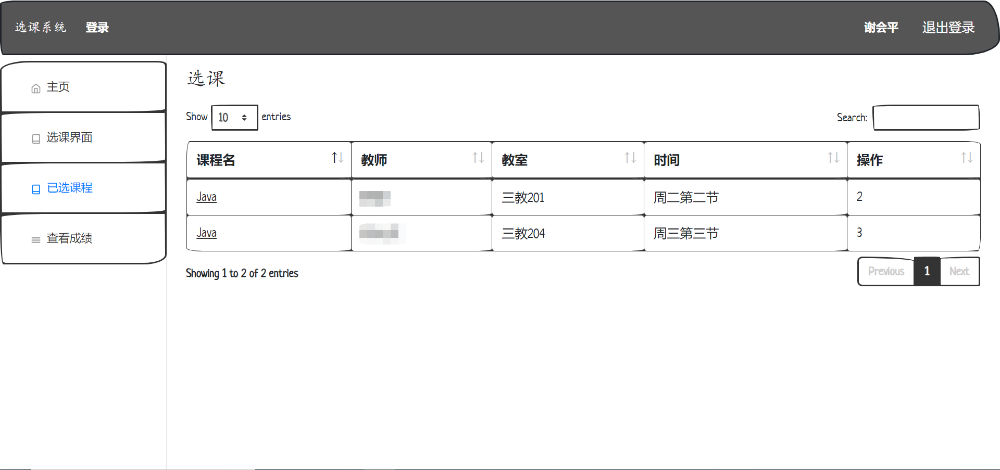

- 查看成绩界面

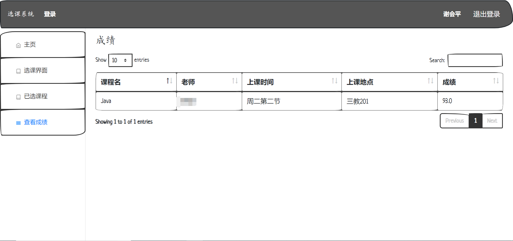

### 老师界面

- 老师主页界面

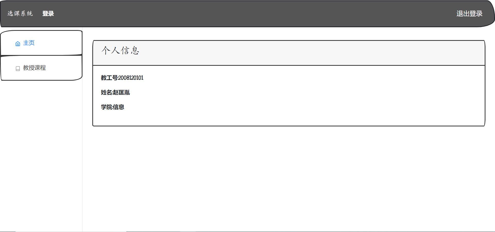

- 老师教授课程界面

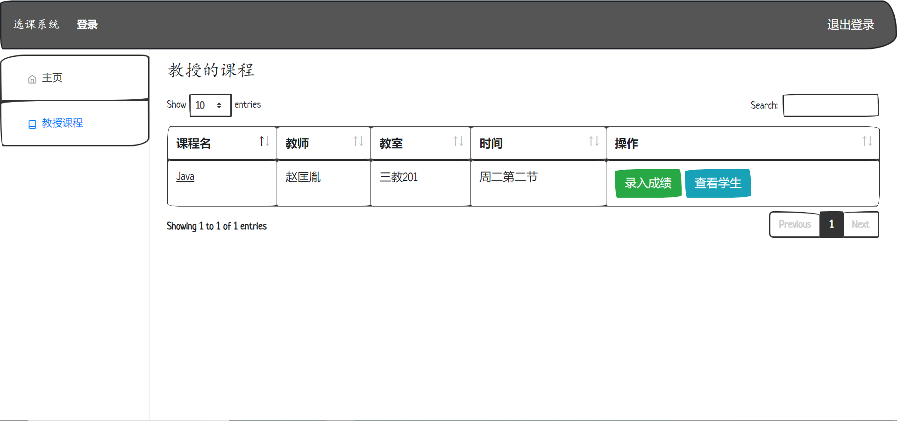

- 查看学生界面

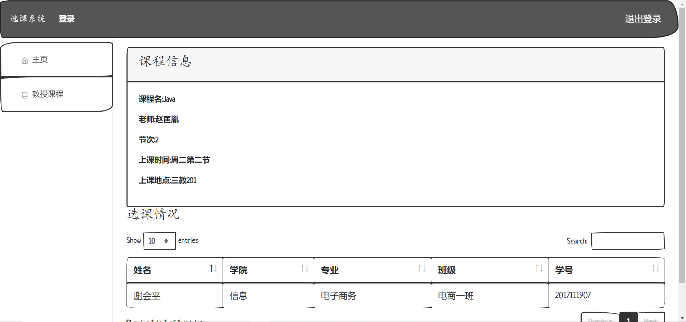

-录入分数界面

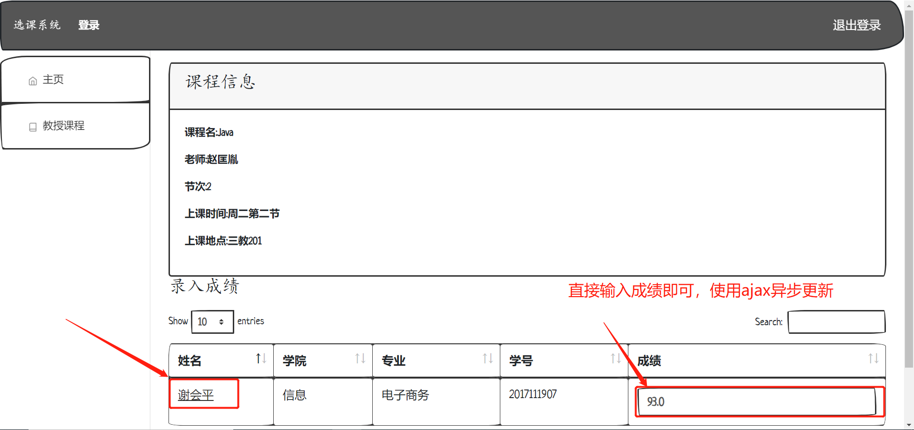

## 四、注意事项

- 待补

## 五、存在不足

- 待补